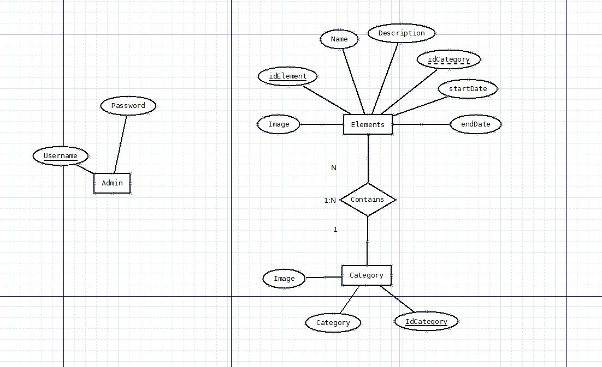
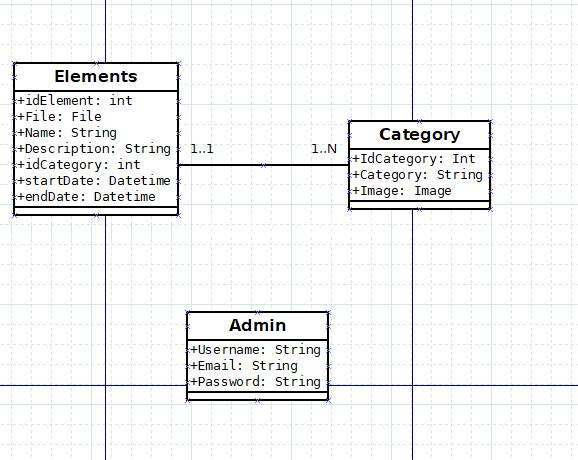
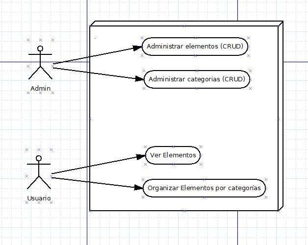

# proyectoCentralUniforme

Esta aplicación es el proyecto solicitado por la central uniforme, la cual requiere de una app que permita a los clientes mantenerse entretenidos
mientras esperan su compra, mediante la reproducción de contenido multimedia (fotos, videos o enlaces a diferentes páginas)

# Diagramas

  
como podemos observar en ambos diagramas, lo solicitado por la empresa es una aplicación que recoja elementos añadidos por los administradores, de los cuales no se requiere ninguna asignación de rol, y pueden trabajar con los elementos que son mostrados a los clientes, los cuales contienen el archivo que será mostrado y los detalles del mismo

# Requisitos de usuario

Recomendado mínimo 8gb de ram para un correcto funcionamiento del servidor de Django, cualquier procesador debería ser suficiente para mantener el servidor a pequeña escala, sin embargo si fuera a implementarse a una mayor escala se requeriría de procesadores mas potentes, y con mas núcleos

# Casos de usos
 

Como está mostrado en el diagrama de casos de uso, los administradores tendrán acceso a todos los CRUDS que permitirán hacer cualquier operación básica en los elementos o las categorías, y los usuarios podrán ver estos elementos y acceder a los mismos
# Funcionamiento del sistema

La aplicación usa por un lado ionic y por otro django, por lo que necesitaremos tener instalado de antemano python y nodejs, además usaremos visual studio code para editar y manipular el código

# Instalación
Antes de instalar el servidor debemos copiar la base de datos mediante la ejecución del archivo basededatosProyecto.sql en MySQLWorkbench, tras esto necesitaremos clonar el repositorio de git en la carpeta objetivo, abrimos dicha carpeta con visual estudio e instalamos los siguientes componentes mediante la introduccion de estos comandos en la terminal:
  
<b>pip install django djangorestframework djangorestframework-jwt</b>  
<b>pip install mysqlclient</b>  
Además debemos cambiar los datos de MySQL en el archivo <b>settings.py</b>, los cuales contienen el nombre de la base de datos a la que conectaremos, el usuario y contraseña de la misma.
  
tras esto debemos ir a la carpeta que contiene el proyecto y la aplicacion y ejecutamos el siguiente comando:  
<b>python manage.py createsuperuser</b>
  
y a este le damos nombre de usuario, contraseña e email de nuestro superusuario que tendra control total del backend, tras tenerlo creado podemos ejecutar el comando:
  <b>python manage.py runserver</b>
   siempre en la carpeta raiz, con esto el servidor debería estar funcionando, tras esto nos dirigimos a <b>localhost:8080/admin/</b> e iniciamos sesión con las credenciales recientemente creadas y ya tendríamos acceso a todas las funciones de nuestro backend
